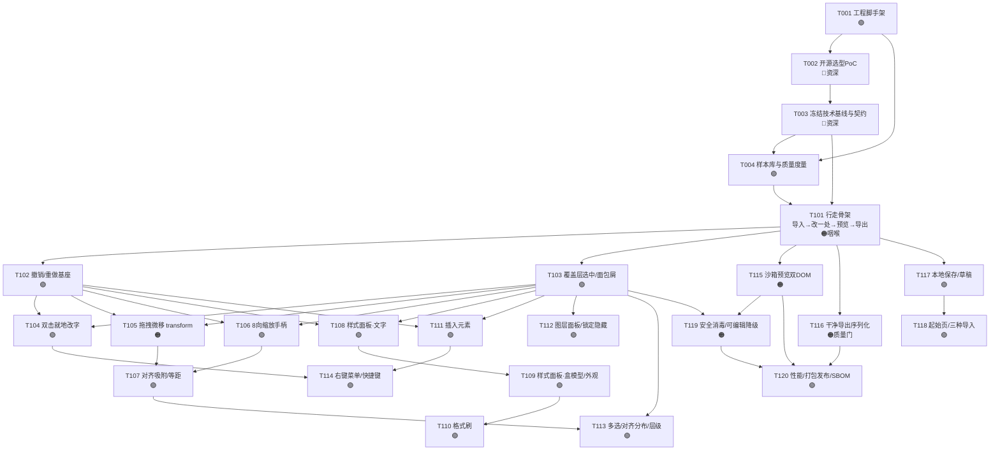

# 00 · 任务规划总览（阶段门禁 / 依赖 / 任务总表）

> 配套：`README-执行指南.md`（执行铁律）、`01-技术基线与接口契约.md`（实现依据）、`02~05-任务卡`。
> 需求依据：PRD v0.2（D1–D7 已锁定）。本文件只规划 **P0**（PRD 第 5.1 节 F1–F11 的落地），P1 不在本规划派发范围。

---

## 1. 规划如何"保证低水平模型也能做对"

1. **决策与实现分离**：所有需要判断的工作（选型、架构、契约、度量设计）集中在 **Stage 0**，由资深/强模型完成并**冻结书面契约**；之后的功能卡只允许"照契约实现"。
2. **第三方库全部藏到适配层**：业务代码只依赖我们自己定义的端口接口（见 `01` §4），换库不改业务卡。
3. **先客观度量，再加功能**：Stage 0 先建好样本库与 `qa:metrics`（命中率/无损率/残留率），让每张卡"做得对不对"可被命令判定，而不是靠人眼。
4. **行走骨架优先**：T101 先打通最薄端到端（导入→改一处→预览→导出），之后每张卡都是在一个**始终可运行**的应用上加厚，避免后期才发现链路不通。
5. **卡片自包含、小颗粒**：每张卡有确切文件、给定签名、编号步骤、常量、边界、DoD、可运行验收和"停下求助"条件。

---

## 2. 阶段与门禁（Stage Gate）

| 阶段 | 内容 | 包含任务 | 进入条件 | 退出（门禁）条件 |
| --- | --- | --- | --- | --- |
| **Stage 0 决策与基建** | 选型 PoC、冻结技术栈与接口契约、脚手架、样本库与质量度量 | T001–T004 | PRD v0.2 锁定（已满足）、Node/git 就绪（已核实） | ① ADR 签字、依赖白名单（含 License）确定；② `01` 契约评审通过；③ `npm run check` 与 `npm run qa:metrics` 可运行并产出基线 JSON；④ 20–30 个样本页入库 |
| **Stage 1 骨架与编辑内核** | 行走骨架 + 撤销基座 + 选中/改字/拖拽/缩放/吸附 | T101–T107 | Stage 0 门禁全绿 | 行走骨架可演示；在样本库上"改字/调色/挪位"三类操作可撤销、可干净导出，残留为 0 |
| **Stage 2 样式与元素** | 样式面板、格式刷、插入元素、图层/锁定、多选对齐、右键快捷键 | T108–T114 | Stage 1 门禁全绿 | F3/F4/F5/F9 主要能力可用；样本库命中率不低于 Stage 1 基线 |
| **Stage 3 预览导出持久化与收尾** | 双 DOM 预览、干净导出、本地保存、起始页、安全降级、性能与发布 | T115–T120 | Stage 2 门禁全绿 | F1–F11 全部达到 PRD 验收；`qa:metrics` 达内部门槛、导出残留 0；可静态部署、可回滚 |
| **公测 M2** | 免登录开放、收集兼容问题 | — | Stage 3 门禁 + 内测 | 按 PRD 第 9 节，非本规划 |

> **硬规定：Stage 0 门禁未全部满足，不得派发任何 Stage 1 卡片。** 决策型任务（🔴）未签字前，不允许执行者自行选择技术方案开工。

---

## 3. 任务依赖关系（拓扑）

**关键路径（决定整体进度）**：T002 → T003 → T101 → T102/T103 → T105 → 后续样式/导出 → T116/T120。
**咽喉任务**：T101（行走骨架）、T116（干净导出）。这两张卡建议由中等以上模型/资深带做并重点评审。

---

## 4. 任务总表（Backlog）

图例：类型 🔴决策型（仅资深/强模型）｜🟠较高风险实现（中等模型或资深带，需重点评审）｜🟢标准实现（低水平模型可做）。复杂度 S 小 / M 中 / L 大。

### Stage 0 · 决策与基建（详见 `02-任务卡-Stage0决策与基建.md`）

| ID | 名称 | 类型 | 复杂度 | 依赖 | 关键验收（一句话） |
| --- | --- | --- | --- | --- | --- |
| T001 | 工程脚手架与质量门禁 | 🟢 | M | — | Vite+TS(strict)+ESLint+Vitest+Playwright 跑通，`npm run check` 可执行 |
| T002 | 开源选型 PoC（PRD 6.0） | 🔴 | L | T001 | 对 ≥3 候选在同一样本上出评分表与 ADR，给出整合/部分/放弃结论 |
| T003 | 冻结技术基线与接口契约 | 🔴 | M | T002 | `01` 文档定稿：栈、目录、端口接口、常量、依赖与 License 白名单评审通过 |
| T004 | 样本页面库 + 质量度量脚本 | 🟢 | M | T001,T003 | 20–30 个分类样本入库；`qa:metrics` 输出命中率/无损率/残留率 JSON 基线 |

### Stage 1 · 行走骨架与编辑内核（详见 `03-任务卡-行走骨架与编辑内核.md`）

| ID | 名称 | 类型 | 复杂度 | 依赖 | 关键验收（一句话） |
| --- | --- | --- | --- | --- | --- |
| T101 | 行走骨架：导入→改一处→预览→导出 | 🟠 | L | T003,T004 | 上传/粘贴 HTML 渲染，双击改一个标题，预览可见，导出无 `ep` 标记且其余无损 |
| T102 | 命令历史与撤销/重做基座 | 🟢 | S | T101 | 任意操作经 ICommand 入栈，Ctrl+Z/Y 正确，20 步往返测试通过 |
| T103 | 覆盖层：hover/选中框/面包屑命中 | 🟢 | M | T101 | hover 高亮、单击选中、面包屑可选父级；覆盖层不写入被编辑 DOM |
| T104 | 双击就地改字（contentEditable 收敛） | 🟢 | M | T102,T103 | 双击编辑、Enter 行为统一、失焦提交并可撤销、无脏标签 |
| T105 | 拖拽微移（transform + 死区/边缘判定） | 🟠 | M | T102,T103 | 5px 死区、边缘拖/内部选字、rAF、transform 位移、可重置、不脱文档流 |
| T106 | 8 向缩放手柄 | 🟢 | M | T102,T103 | 8 向改宽高、Shift 等比、最小尺寸保护、可撤销 |
| T107 | 对齐吸附与等距提示 | 🟢 | M | T105,T106 | 6px 边/中线吸附、≥3 元素 4px 等距提示，参考线在覆盖层 |

### Stage 2 · 样式面板与元素操作（详见 `04-任务卡-样式面板与元素操作.md`）

| ID | 名称 | 类型 | 复杂度 | 依赖 | 关键验收（一句话） |
| --- | --- | --- | --- | --- | --- |
| T108 | 样式面板骨架 + 文字属性 | 🟢 | M | T103,T102 | 字体/号/重/色/背景/对齐/行高/字距/列表/链接双向同步并可撤销 |
| T109 | 盒模型与外观属性 | 🟢 | M | T108 | 宽高、margin/padding、边框、圆角、阴影、透明度可调并正确写回 |
| T110 | 格式刷 | 🟢 | S | T109 | 复制计算样式到目标内联样式，双击连续涂抹，可一次撤销 |
| T111 | 插入元素 | 🟢 | M | T102,T103 | 文本/标题/按钮/图片/形状/容器/表格可插入、选中、删除；图片三来源 |
| T112 | 图层面板 + 锁定/隐藏/层级 | 🟢 | M | T103 | DOM 树同步、显隐/锁定生效、锁定元素不可拖、置顶置底 |
| T113 | 多选 + 对齐/分布 | 🟢 | M | T107,T103 | 框选/Shift 多选，左右上下对齐与等距分布，结果可撤销 |
| T114 | 右键菜单 + 快捷键体系 | 🟢 | M | T104,T111 | Office 快捷键（Z/Y/S/B/I/U、方向微移、Ctrl+D/L、Delete）与上下文菜单生效 |

### Stage 3 · 预览 / 导出 / 持久化 / 收尾（详见 `05-任务卡-预览导出持久化与收尾.md`）

| ID | 名称 | 类型 | 复杂度 | 依赖 | 关键验收（一句话） |
| --- | --- | --- | --- | --- | --- |
| T115 | 沙箱预览（iframe srcdoc 双 DOM） | 🟠 | M | T101 | 预览脚本运行/交互可点/样式隔离，切回恢复滚动、不污染编辑器 |
| T116 | 干净导出序列化（质量门） | 🟠 | L | T101 | 剥离全部编辑器注入，未改动部分 diff 无损，外链资源给清单 |
| T117 | 本地保存与自动草稿 | 🟢 | M | T101 | IndexedDB 自动草稿、File System Access 直存，不支持则下载降级 |
| T118 | 起始页与三种导入 + 容错提示 | 🟢 | M | T117 | 上传/粘贴/空白三入口、最近草稿、残缺 HTML 容错与脚本提示 |
| T119 | 安全消毒与可编辑性降级 | 🟠 | M | T103,T115 | 编辑态不跑脚本、恶意脚本沙箱隔离；Shadow/canvas/SVG 整体操作并有提示 |
| T120 | 性能/规模、打包发布、SBOM | 🟢 | M | T116,T115,T119 | 大页不卡（rAF/合成层）、静态构建可灰度回滚、依赖许可清单与 NOTICE 齐全 |

---

## 5. 复杂度与派单建议

- **S（小，0.5 天内）**：可派给最弱模型，但仍须完整 DoD。
- **M（中，1–2 天）**：低水平模型可做，需严格按卡与契约；评审时重点看范围与验收。
- **L（大，2 天以上）或 🟠**：建议中等模型/初级在资深拆解后做，或资深带做；T002、T003 为 🔴，**禁止派给只做实现的低水平模型**。
- 每张卡合入后都必须满足：`npm run check` 全绿 + `qa:metrics` 不劣化 + 应用可打开。**不接受"功能做完了但链路跑不通"的合并。**

## 6. 不在本规划内（提醒，勿擅自开工）

- P1：URL 导入、AI/MCP、PDF/PNG、class 写回模式、多页站点、模板素材库、云同步。
- 任何 §README §7 "明确不做"清单项。
- 若评审中发现需要新增卡片，由调度者在本总表登记新 ID（如 T121）并写同规格卡片后再派发，执行者不得自行加卡。
